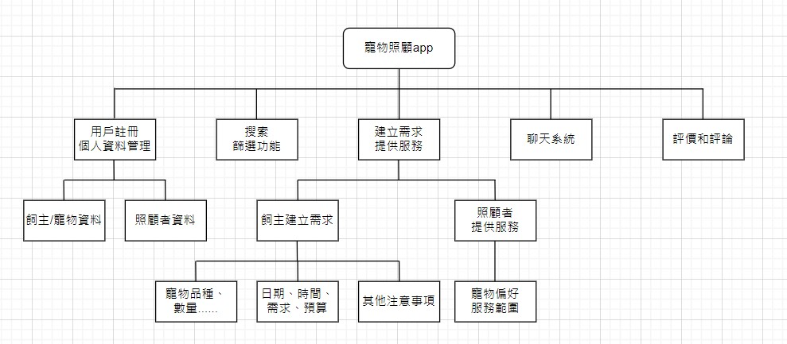
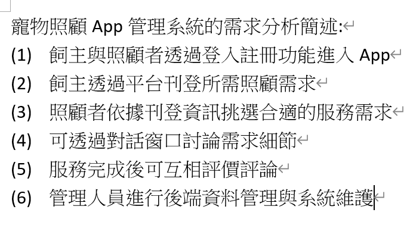
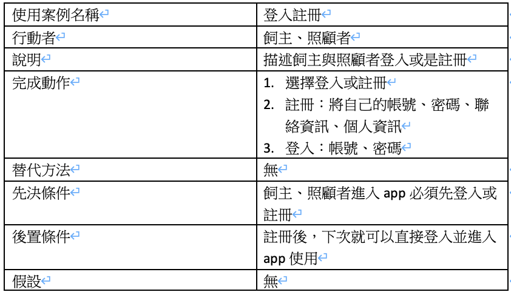
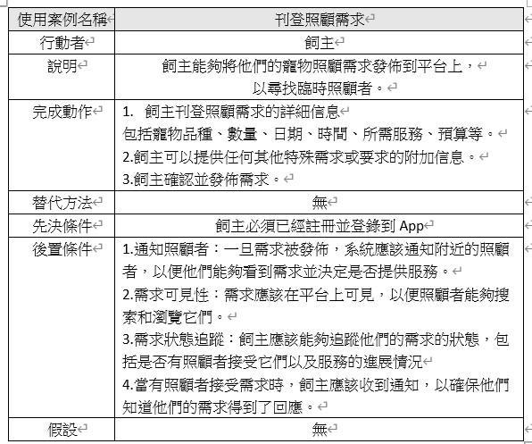
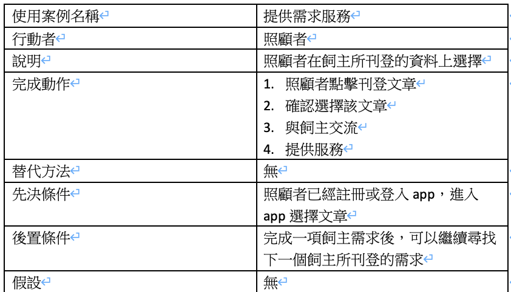

### **功能性需求:**

1.用戶註冊和個人資料管理：
飼主和照顧者應能夠註冊帳戶，並提供必要的個人資料（如名字、聯絡資訊、地址、寵物信息）。
用戶應能夠編輯和更新其個人資料。

2.建立需求或提供服務：
飼主可以建立需求，包括寵物類型、數量、日期、時間、服務需求、預算等信息。
照顧者可以創建服務提供列表，提供照顧經驗、寵物偏好和服務範圍。

3.搜索和篩選功能：
飼主能夠搜索附近的照顧者，根據地理位置、寵物類型、價格範圍等條件進行篩選。

4.內建聊天系統：
用戶之間可以進行即時聊天，以討論需求的詳細信息、價格、時間表等。

5.評價和評論：
用戶可以對對方進行評價和留下評論，以建立可信任的社群。

6.通知和提醒：
系統應該能夠發送通知和提醒，包括預約確認、聊天信息、評價等

### **非功能性需求:**

1.安全性：
用戶數據應該受到嚴格的加密和安全保護，以防止數據洩露。

2性能：
應用程序應具有優良的性能，以確保快速載入和即時聊天功能的迅速回應。

3.用戶體驗：
應用程序應提供直觀的用戶界面，以便用戶能夠輕鬆使用。

4.隱私保護：
需要明確的隱私政策，並確保用戶數據的保護。

5.法規合規性：
確保應用程序遵循當地和國家法律，特別是與寵物照顧相關的法規。

6.容錯性：
應用程序應具有容錯性，以處理系統錯誤和故障。

7.平台兼容性：
確保應用程序能夠在不同的 Android 設備上運行順暢

### **功能分解圖:**

### **需求分析文字描述**

### **使用案例圖**

### **使用案例說明**

### **動態模擬畫面**
<https://www.figma.com/file/vH9hKerAybb4F2KJvZOEWV/%E7%AC%AC%E4%BA%94%E7%B5%84%E5%AF%B5%E7%89%A9%E7%85%A7%E9%A1%A7App?type=design&node-id=0%3A1&mode=design&t=Ae52jvLCcopIAs4b-1>
